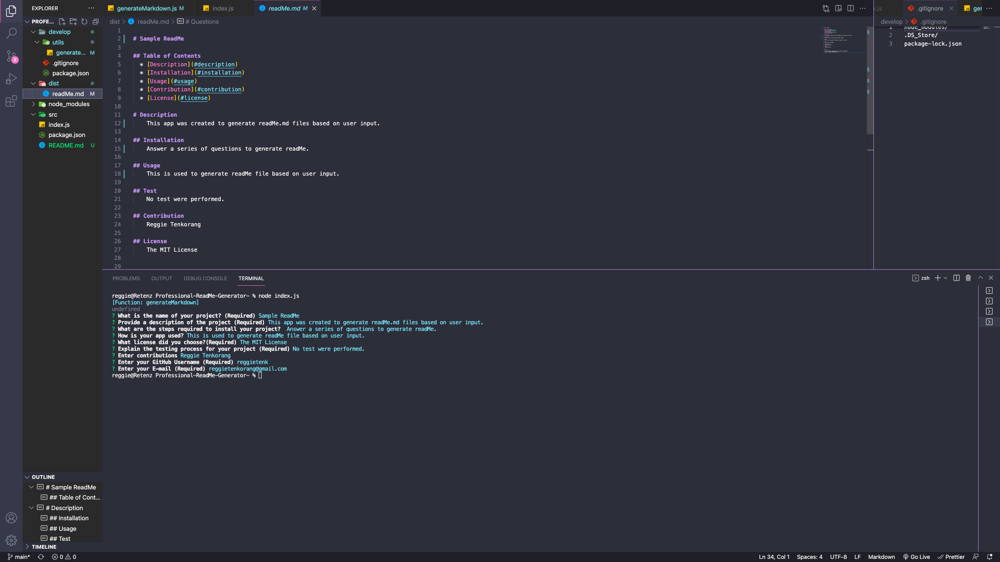

# Professional ReadMe Generator

## Description 

The professional readMe generate is your one stop app for readMe creation. This app was created wit node.js, when you first run the app the a prompted with a series of questions. Then based on the users input a readMe.de file is then generated and ready for your project.

## Table of Contents 


* [Installation](#installation)
* [Usage](#usage)
* [Credits](#credits)
* [License](#license)


## Installation
Install npm using command lines (npm install)


## Usage 

```md

```

To watch app demo please click here [https://www.loom.com/share/a3804a3e19974a79816615bbf554f672]


## License
License Options:

- MIT 
- Apache License 2.0
- GNU General Public License v3.0


## Badges


Badges hosted by [shields.io](https://shields.io/). 


## Contribution

Reggie Tenkorang


## Tests

No test were performed. 
